  

### Software Engineering Student • Frontend Developer • UI/UX Enthusiast

  

 

> **Learning with purpose • Building with creativity • Growing one project at a time.** 🚀

---

## 🚀 About Me

🎓 **BS Software Engineering Student:** Currently in my 3rd semester at **Virtual University** 🏛️

💼 **Working Professional:** Balancing real-world work experience alongside my academic journey 💻

🌐 **Frontend Developer:** Building responsive, modern web applications using **HTML, CSS, JavaScript & Tailwind CSS** ⚡

🎨 **UI/UX Enthusiast:** Designing clean, user-friendly layouts and wireframes with **Figma** 🖌️

🛠️ **Problem Solver & Tech Explorer:** Working with **C++, SQL & Git/GitHub** with a passion for continuous learning 🐙

---

## 💻 Skills & Technologies

### 🌐 Frontend Development

 

### 💡 Programming & Database

 

### 🎨 UI/UX & Version Control

---

## 🧰 Tools I Use

  
  
  
  
  

**VS Code** • **Figma** • **GitHub** • **Git** • **Dev-C++** • **UI/UX**

---
<h2 align="center">🌟 Featured Projects</h2>

<table align="center" width="100%">
  <tr>
    <td align="center" width="50%">
      <h3>📝 To-Do List</h3>
      
<b>HTML • CSS • JavaScript</b>

      
A simple and interactive To-Do List web application focused on clean UI and practical task management.

    </td>
    <td align="center" width="50%">
      <h3>🧁 Crust & Crumbs Bakery</h3>
      
<b>HTML • CSS • JavaScript</b>

      
A responsive bakery website designed to showcase products with a modern, user-friendly frontend experience.

    </td>
  </tr>
  <tr>
    <td align="center" width="50%">
      <h3>🧮 Simple Calculator</h3>
      
<b>HTML • CSS • JavaScript</b>

      
A clean, interactive, and fast web calculator designed to perform daily arithmetic calculations with a modern UI.

    </td>
    <td align="center" width="50%">
      <h3>🚀 Coming Soon</h3>
      
<b>Tech Stack</b>

      
Project description will go here once the 4th repository is ready.

    </td>
  </tr>
</table>
---

## 🎓 Education

**Virtual University (VU)**

**BS Software Engineering — 3rd Semester** 🏛️

---

## 💼 Currently

💻 Working alongside my studies

🎓 BS Software Engineering student

🌐 Improving my frontend development skills

🎨 Exploring UI/UX and better web experiences

🚀 Building projects and learning new technologies

---

## 📊 GitHub Stats

  
  

---

## 💜 GitHub Contributions

  

---

## 📫 Let's Connect

 

  

---

### ✨ **Keep Learning • Keep Building • Keep Growing** ✨

**Thanks for visiting my profile! 💜**

